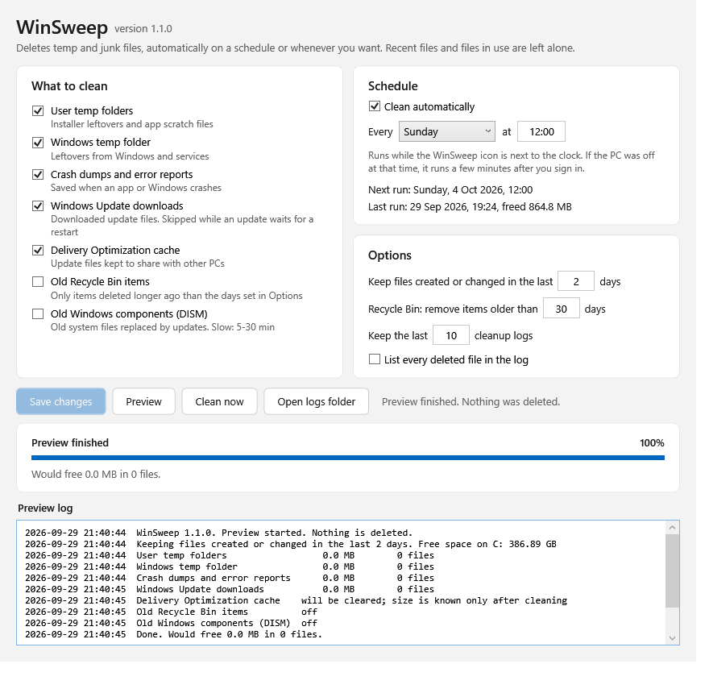

# WinSweep

WinSweep deletes temp and junk files on Windows. It cleans automatically on a schedule you choose, and
you can also start a cleanup yourself at any time. It's a few PowerShell scripts, a small settings
window and an icon next to the clock. While the icon is there, WinSweep is active; close it and nothing
of WinSweep runs. It doesn't connect to the internet and doesn't install a service.

[](LICENSE)




## Install

1. [Download the ZIP](https://github.com/hight1337/WinSweep/archive/refs/heads/main.zip) (or use **Code > Download ZIP** on this page).
2. Unzip it.
3. Double-click `Install.cmd` and allow the admin prompt.

Windows will probably show "Windows protected your PC", because the scripts aren't signed. Click
**More info**, then **Run anyway**. If you want to check the code first, every file is plain text and
opens in Notepad.

You need Windows 10 or 11. PowerShell 5.1 comes with Windows, so there's nothing else to install.

## Using it

After you install it, a broom icon appears next to the clock. If you don't see it, it may be hidden
under the **^** arrow; you can drag it onto the taskbar.

- **Click** the icon to open WinSweep.
- **Hover** over it to see when the next cleanup is. While a cleanup runs, the broom moves.
- **Right-click** it and choose **Close WinSweep** to stop it until your next sign-in, or until you
  open WinSweep from the Start menu. To keep it from starting at sign-in, turn off **WinSweep** in
  **Task Manager > Startup apps**.

While the icon runs, WinSweep cleans every Sunday at 12:00. You can pick a different day and time or
turn automatic cleaning off. If the PC was off or the icon was closed at that time, the cleanup runs a
few minutes after the icon starts again.

In the WinSweep window you choose what to clean, set the schedule and click **Save changes**. **Preview**
shows what would be deleted without deleting anything, and **Clean now** cleans right away. Each
cleanup writes a log to `C:\ProgramData\WinSweep\logs`, and the last 10 logs are kept.

## What gets deleted

A file is deleted only if it was created and last changed more than 2 days ago. Files that are in use
are skipped. You can change the 2 days in the settings window.

On by default:

- `C:\Users\<name>\AppData\Local\Temp`, for every user
- `C:\Windows\Temp`
- Crash dumps and error reports: `C:\Windows\Minidump`, `C:\Windows\LiveKernelReports`,
  `C:\ProgramData\Microsoft\Windows\WER` and `AppData\Local\CrashDumps` for every user
- Windows Update downloads in `C:\Windows\SoftwareDistribution\Download`. This is skipped while an
  update is waiting for a restart.
- The Delivery Optimization cache, cleared with Windows' own `Delete-DeliveryOptimizationCache`

Off by default:

- Recycle Bin items deleted more than 30 days ago
- `DISM /Online /Cleanup-Image /StartComponentCleanup`, which removes old versions of Windows
  components. It takes 5 to 30 minutes.

## What it doesn't touch

Your own files (Documents, Downloads, Desktop and so on), browser caches, Prefetch, event logs, the
registry and Windows settings. Nothing outside the folders listed above is deleted: right before a file
is deleted, WinSweep checks where it really is, so a junction or symbolic link can't lead it anywhere
else.

Browser caches and Prefetch are left alone on purpose. Clearing them mostly makes things slower for a
while, and they fill up again anyway.

## How it works

`Install.cmd` creates `C:\ProgramData\WinSweep` so that only administrators can change it, then copies
the scripts there. That matters because the cleaner runs as SYSTEM. It also builds a small helper,
`WinSweep.Native.dll`, from `WinSweepNative.cs` in this repository, and adds:

- A scheduled task, `WinSweep\Cleanup`, which runs the cleaner as SYSTEM. It has no schedule of its
  own; the tray icon starts it. Signed-in users may start it, not change it.
- A startup entry for the tray icon. The icon runs as you, without admin rights, and never deletes
  anything itself. It checks every 30 seconds whether a cleanup is due and uses about 70 MB of
  memory (mostly PowerShell itself) and no noticeable CPU.
- The Start menu shortcut, which starts the icon (if it isn't running) and opens the window.

`WinSweep.ps1` does the cleaning. It reads folders with the .NET file APIs instead of `Get-ChildItem`,
which is about 10 times faster on large folders. On my PC it scans the Windows Update folder (about
200,000 files) in around a second. Only one cleanup can run at a time. Each file is opened, its real
location is checked, and it is deleted through that same open handle, so it can't be swapped for
another file in between.

To try the cleaner without installing it or deleting anything, run this in the unzipped folder:

```powershell
powershell -NoProfile -ExecutionPolicy Bypass -File .\WinSweep.ps1 -DryRun
```

## Uninstall

Double-click `Uninstall.cmd`. It removes the tray icon and its startup entry, the scheduled task, the
Start menu shortcut and `C:\ProgramData\WinSweep`, including your settings and logs.

## FAQ

**Can I get deleted files back?**
No. Files are deleted, not moved to the Recycle Bin. Run Preview first if you're not sure.

**Why does it need admin rights?**
Cleaning `C:\Windows\Temp` and the Windows Update folder needs them. That's why the WinSweep window
asks for them each time you open it (the usual UAC prompt). The tray icon runs without them.

**Does it send any data anywhere?**
No. There's no network code in the scripts.

**Which version do I have, and how do I update?**
The version is shown next to the name in the settings window and at the top of each log. To update,
download the ZIP again and run `Install.cmd`. Your settings and logs are kept.

**Does it work on Windows in other languages?**
Yes.

## Files

| File | What it does |
|---|---|
| `WinSweep.ps1` | The cleaner. The scheduled task and the settings window both run it |
| `WinSweepUI.ps1` | The settings window |
| `WinSweepTray.ps1` | The tray icon. It starts the scheduled cleanups and draws the WinSweep icon |
| `WinSweepNative.cs` | Safe file deletion and two Windows calls. The installer builds it into `WinSweep.Native.dll` |
| `Install-WinSweep.ps1` | Sets up the program folder, builds the helper, creates the task, the tray startup entry and the shortcut |
| `Uninstall-WinSweep.ps1` | Removes everything the installer added |
| `Install.cmd`, `Uninstall.cmd` | Double-click these instead of running the scripts directly |

## Contributing

Bug reports and pull requests are welcome in [Issues](../../issues). If WinSweep is useful to you, a
star helps other people find it.

## License

[MIT](LICENSE)
